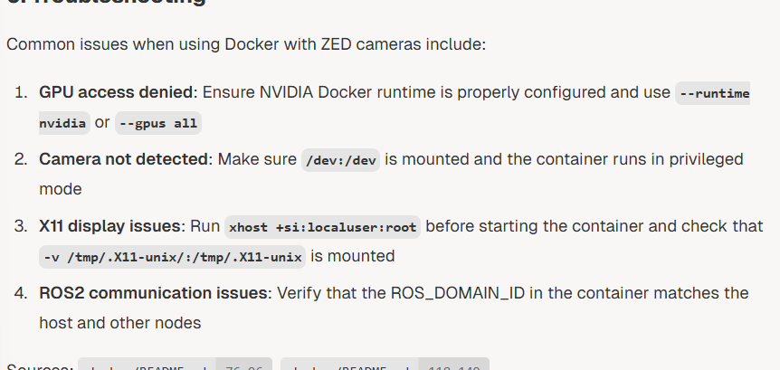

md
# ZED ROS 2 Wrapper — Quick Notes (Markdown)

## Main files

### Launch file
- **`zed_camera.launch.py`**

### Config file
- **`common_stereo.yaml`**

---

## Key config notes

### Camera selection
- `camera_model`: `'zedm'` or `'zed2i'`
- `camera_name`: `'zed'` *(placeholder name; becomes part of topic namespaces)*

### Common TF / URDF / tracking flags

| Param | Default | Meaning |
|---|---:|---|
| `publish_urdf` | `'true'` | Enable URDF processing + Robot State Publisher |
| `publish_tf` | `'true'` | Enable `odom -> camera_link` TF publication |
| `publish_map_tf` | `'true'` | Enable `map -> odom` TF publication |
| `publish_imu_tf` | `'false'` | Enable IMU TF publication |
| `enable_gnss` | `'false'` | Enable GNSS fusion for positional tracking |
| `ros_params_override_path` | `''` | Path to additional YAML to override default parameters |


## Launch example

```bash
ros2 launch zed_wrapper zed_camera.launch.py \
  camera_model:=zed2 \
  camera_name:=my_zed2 \
  serial_number:=31622224
````

### Check all parameters

* [https://deepwiki.com/stereolabs/zed-ros2-wrapper/3.1-stereo-camera-configuration](https://deepwiki.com/stereolabs/zed-ros2-wrapper/3.1-stereo-camera-configuration)

---

## Most useful parameters (current shortlist)

### General / output

* `pub_resolution`
* `pub_frame_rate`

### Image controls

* `auto_exposure_gain`
* `gain`
* `contrast`
* `saturation`
* `hue`
* `brightness`

### Point cloud

* `point_cloud_freq`
* `point_coud_res` *(typo? maybe `point_cloud_res`)*

### Depth

* `openni_depth_mode` *(m or uint16)*
* `depth_mode`

### SLAM / positional tracking

* `pos_tracking_enabled`
* `publish_tf`
* `publish_map_tf`

### GNSS fusion

* `fnss_fusion_enabled` *(typo? maybe `gnss_fusion_enabled`)*
* `gnss_fix_topic`

### Object detection

* `od_enabled`

### Body tracking

* `bt_enabled`

### Camera-specific (grab)

* `grab_resolution`
* `grab_frame_rate`
* `min_depth`
* `max_depth`

### ROI (Region of Interest)

* `ROI` *(focuses processing on one part of the image — see ROI section below)*

### Thread priority / scheduling

* `thread_grab_priority`
* `thread_sensor_priority`
* `thread_poincloud_priority` *(typo? maybe `thread_pointcloud_priority`)*

---

## Depth performance setup (modes)

| Mode          | Description                        | Compute cost |
| ------------- | ---------------------------------- | ------------ |
| `PERFORMANCE` | Fastest, lower accuracy            | Low          |
| `QUALITY`     | Balanced depth sensing             | Medium       |
| `ULTRA`       | High-quality depth                 | High         |
| `NEURAL`      | Neural network enhanced            | High         |
| `NEURAL_PLUS` | Best accuracy for difficult scenes | Highest      |

---

## Video publish resolutions

* `HD2K`, `HD1080`, `HD720`, `MEDIUM`, `VGA`, `LOW`

---

## Useful topics (common)

### Images

* `~/rgb/image_rect_color`
* `~/left/image_rect_gray`

### Depth + 3D

* `~/depth/depth_registered`
* `~/point_cloud/cloud_registered`

### Tracking

* `~/pose`
* `~/odom`

---

## URDF / Xacro setup

A xacro/urdf setup exists. Example:

```xml
<xacro:include filename="$(find zed_wrapper)/urdf/zed_macro.urdf.xacro" />

<xacro:zed_camera name="zed" model="zed2" enable_gnss="false">
  <origin xyz="0 0 0" rpy="0 0 0"/>
</xacro:zed_camera>

<joint name="camera_joint" type="fixed">
  <parent link="robot_base_link"/>
  <child link="zed_camera_link"/>
  <origin xyz="0.2 0 0.1" rpy="0 0 0"/>
</joint>
```

### Gimbal transform strategy (example chain)

`map → odom → base_link → gimbal_mount_link → camera_link → left_camera_optical_frame`

---

## ROI (Region of Interest)

* Enables focusing processing on a specific image area.
* **Dynamic change?** *(uncertain)*
* Automatic ROI: system detects parts of the robot in the field of view and excludes them from processing.

---

## Specific ONNX model integration

* Enables direct local detection of objects without manual processing.

---

## Network streaming possibilities

*(placeholder — not detailed in these notes)*

---

## Simulation mode

* `sim_mode`: param for simulation
* `simulation.sim_address`: simulator address
* `simulation.sim_port`: communication port

---

## Stereo vision principles

*(placeholder — not detailed in these notes)*

---

## GNSS Fusion & Mapping

* [https://deepwiki.com/stereolabs/zed-ros2-wrapper/4.4-gnss-fusion-and-mapping](https://deepwiki.com/stereolabs/zed-ros2-wrapper/4.4-gnss-fusion-and-mapping)

---

## Object detection (custom ONNX supported)

Supports a **custom ONNX** model.

### To use a custom model

1. Set model to `CUSTOM_YOLOLIKE_BOX_OBJECTS`
2. Set path to the ONNX model file: `custom_onnx_file`
3. Set input tensor size: `custom_onnx_input_size`
4. Provide YAML class labels: `custom_label_yaml`

### Results published on

* `/<camera_name>/zed_node/obj_det/objects`

Message type:

* `zed_msgs/ObjectsStamped`

Includes (as noted):

* 3D position and dimensions
* Tracking ID
* 2D bounding box
* 3D velocity

### Enable/disable at runtime (services)

* `/<camera_name>/zed_node/enable_obj_det` — `std_srvs/SetBool` — enable/disable object detection
* `/<camera_name>/zed_node/enable_body_trk` — `std_srvs/SetBool` — enable/disable body tracking

---

## Docker images available

### Desktop Docker images

* For **x86_64** systems with NVIDIA GPUs
* Based on Ubuntu + CUDA
* Supports ROS 2 Humble
* Compatible with all ZED camera models

### Jetson Docker images

* For **NVIDIA Jetson** platforms
* Based on L4T (Linux for Tegra)
* Supports ROS 2 Humble
* Optimized for embedded systems

---

## Docker prerequisites

* Docker installed
* NVIDIA Container Toolkit (GPU support)
* git (to clone)

---

## Build scripts

### Desktop build

```bash
./desktop_build_dockerfile_from_sdk_ubuntu_and_cuda_version.sh \
  <Ubuntu version> <CUDA version> <ZED SDK version>
```

Example:

```bash
./desktop_build_dockerfile_from_sdk_ubuntu_and_cuda_version.sh \
  ubuntu-22.04 cuda-12.6.3 zedsdk-4.2.5
```

### Jetson build

```bash
./jetson_build_dockerfile_from_sdk_and_l4T_version.sh \
  <L4T version> <ZED SDK version>
```

Example:

```bash
./jetson_build_dockerfile_from_sdk_and_l4T_version.sh \
  l4t-r36.3.0 zedsdk-4.2.5
```

---

## Docker run / compose requirements (runtime options)

* Enable GPU access with `--runtime nvidia` or `--gpus all`
* Set NVIDIA driver capabilities: `-e NVIDIA_DRIVER_CAPABILITIES=all`
* Privileged mode: `--privileged`

Host integration:

* `--network=host` (share host network stack)
* `--ipc=host` (shared memory communication)
* `--pid=host` (process namespace sharing)

ROS:

* Set `ROS_DOMAIN_ID` environment variable (default: `0`)

X11 display:

* `-e DISPLAY=$DISPLAY`
* `-v /tmp/.X11-unix/:/tmp/.X11-unix`
* Allow container to access display:

  ```bash
  sudo xhost +si:localuser:root
  ```

### Recommended mounts

```bash
-v /tmp/.X11-unix/:/tmp/.X11-unix \
-v /dev:/dev \
-v /dev/shm:/dev/shm \
-v /usr/local/zed/resources/:/usr/local/zed/resources/ \
-v /usr/local/zed/settings/:/usr/local/zed/settings/
```

### Example `docker run`

```bash
docker run --runtime nvidia -it --privileged --network=host --ipc=host --pid=host \
  -e NVIDIA_DRIVER_CAPABILITIES=all -e DISPLAY=$DISPLAY \
  -v /tmp/.X11-unix/:/tmp/.X11-unix \
  -v /dev:/dev \
  -v /dev/shm:/dev/shm \
  -v /usr/local/zed/resources/:/usr/local/zed/resources/ \
  -v /usr/local/zed/settings/:/usr/local/zed/settings/ \
  <docker_image_tag>
```

### AI feature interaction note

When using AI features (object detection / skeleton tracking), bind-mount the resources directory to avoid re-downloading and optimizing models each run:

```bash
-v /usr/local/zed/resources/:/usr/local/zed/resources/
```

Offline usage (no internet): download camera calibration files in advance and mount:

```bash
-v /usr/local/zed/settings/:/usr/local/zed/settings/
```

---

## Figure



```
```
